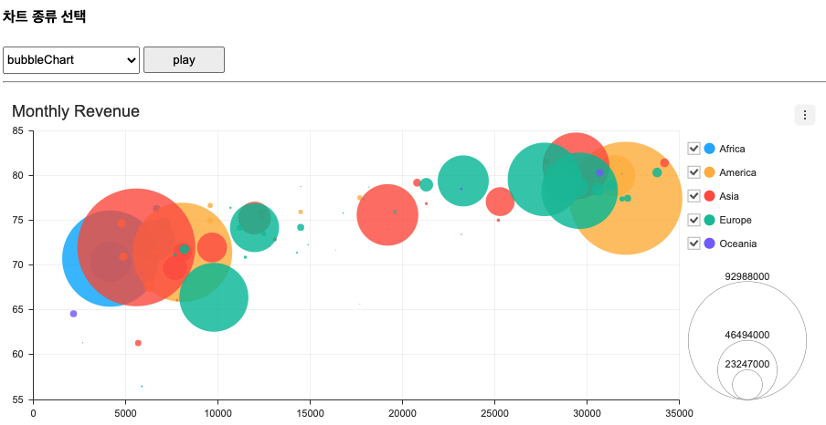
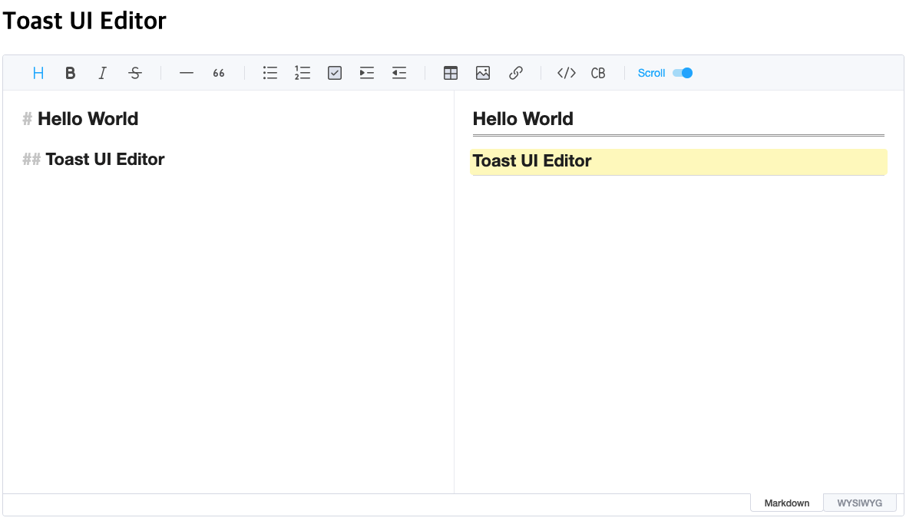
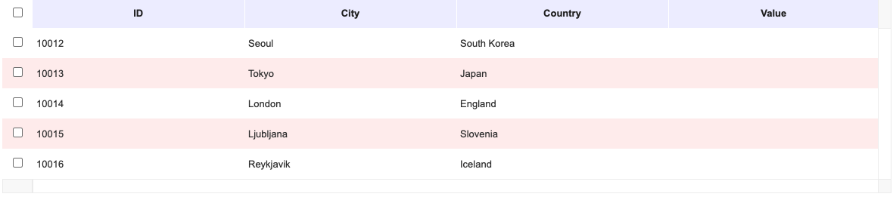
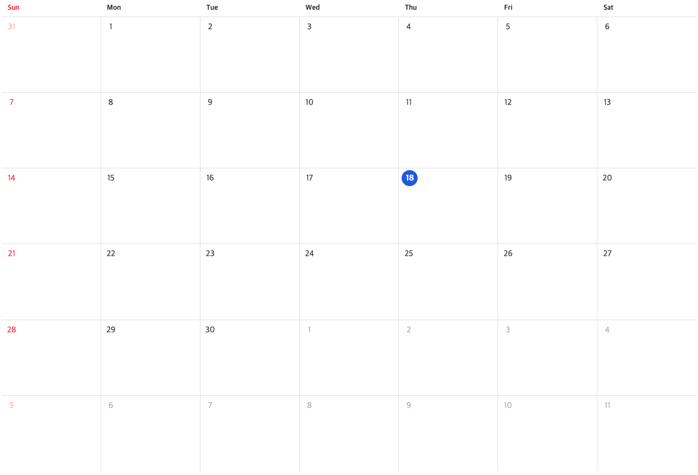

# study_ToastUI

## 📈 chart

[chart](/readme/chart.md)

[**Live**](https://byeongminlee.github.io/study_toastUI/page/chart/chart_list.html)

## 📖 editor

[editor](/readme/editor.md)

[**Live**](https://byeongminlee.github.io/study_toastUI/page/editor/editor2.html)

## 🧾 grid

[grid](/readme/grid.md)

[**Live**](https://byeongminlee.github.io/study_toastUI/page/grid/grid2.html)

## 📅 calendar

[calendar](/readme/calendar.md)

[**Live**](https://byeongminlee.github.io/study_toastUI/page/calendar/calendar.html)
